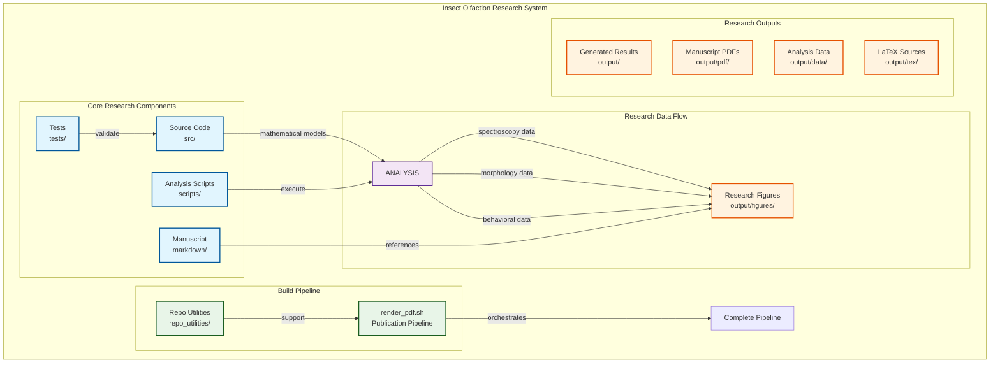
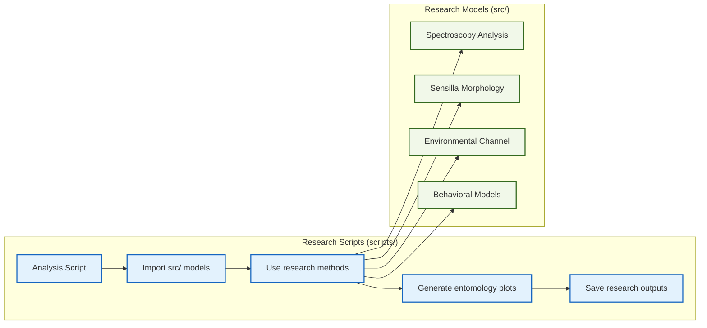
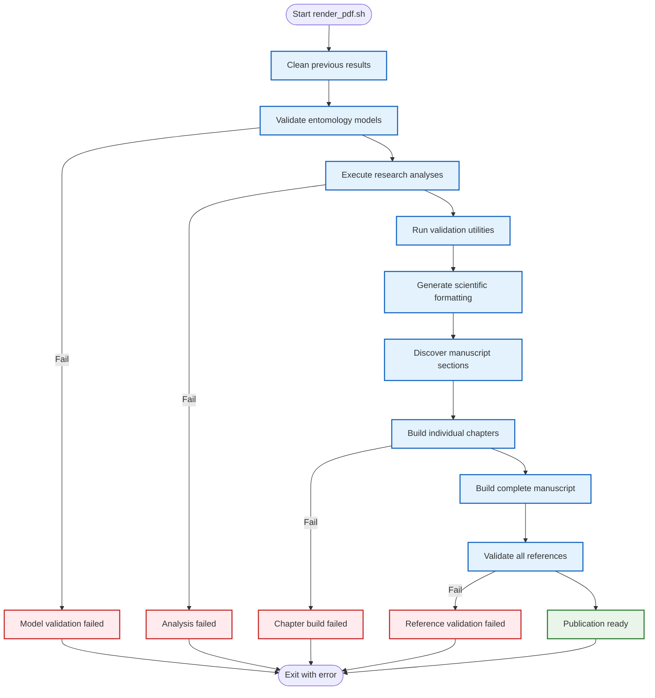
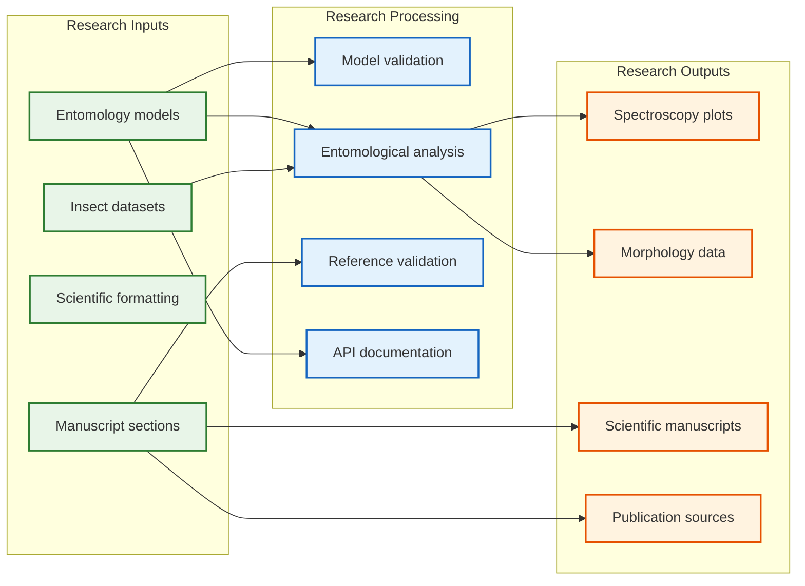

# cohereants: Insect Olfaction Research Architecture

This document provides a comprehensive overview of the cohereants project architecture, which investigates the vibrational theory of olfaction in insects. The system integrates entomological research, computational analysis, and scientific publication workflows to explore how insects detect infrared radiation from semiochemicals. For related information, see **[`README.md`](README.md)** for project overview, **[`WORKFLOW.md`](WORKFLOW.md)** for development workflow, and **[`HOW_TO_USE.md`](HOW_TO_USE.md)** for usage guidance.

## Research Architecture Overview



## Component Interactions

### 1. Source Code (`src/`)
**Purpose**: Implements entomological research models and data analysis algorithms with comprehensive test coverage.

**Key Research Modules**:
- `spectroscopy.py`: Infrared spectroscopy analysis and vibrational calculations
- `sensilla.py`: Insect antenna and sensilla morphology modeling
- `environmental_channel.py`: Atmospheric transmission and environmental effects
- `behavioral_analysis.py`: Insect behavioral response modeling
- `visualization.py`: Specialized plots for entomological data

**Research Responsibilities**:
- Provide validated models for insect sensory systems
- Implement spectral analysis algorithms for semiochemical detection
- Calculate optimal detection wavelengths based on sensilla dimensions
- Model atmospheric transmission in infrared windows
- **CRITICAL**: Contain ALL research algorithms and mathematical models

### 2. Test Suite (`tests/`)
**Purpose**: Validates all entomological research models with 100% test coverage.

**Coverage Requirements**:
- **Statement coverage**: 100% of all research code lines executed
- **Branch coverage**: 100% of all conditional branches in models
- **Real data validation**: All tests use actual entomological datasets
- **Reproducible results**: Fixed RNG seeds (42) for consistent outputs

**Research Validation Scope**:
- Mathematical correctness of spectral analysis algorithms
- Accuracy of sensilla morphology calculations
- Validation of atmospheric transmission models
- Behavioral response model verification
- Integration between research modules

### 3. Analysis Scripts (`scripts/`)
**Purpose**: **Thin orchestrators** that import and use `src/` methods to generate research figures and analyze entomological data.

**Key Research Scripts**:
- `generate_spectroscopy_analysis.py`: Generate infrared spectroscopy figures
- `generate_sensilla_analysis.py`: Analyze insect antenna morphology
- `generate_environmental_channel.py`: Model atmospheric transmission effects
- `generate_behavioral_analysis.py`: Analyze insect behavioral responses
- `generate_integrated_analysis.py`: Comprehensive multi-modal analysis

**Thin Orchestrator Pattern for Research**:


**Research Workflow**:
1. Import entomological models from `src/` modules
2. Use src/ methods for spectral analysis and morphological calculations
3. Generate specialized visualizations for insect sensory systems
4. Process real entomological datasets
5. Generate deterministic outputs with fixed seeds (42)
6. Save research figures to `output/figures/`
7. Save analysis data to `output/data/`
8. Print output paths for publication pipeline

### 4. Research Manuscript (`markdown/`)
**Purpose**: Document the vibrational theory of insect olfaction with integrated computational analysis.

**Manuscript Structure**:
- `00_preamble.md`: LaTeX preamble and scientific formatting
- `01_abstract.md`: Research overview and key findings
- `02_introduction.md`: Background on olfaction theories and limitations
- `03_methodology.md`: Vibrational theory framework and infrared detection
- `04_experimental_results.md`: Computational analysis and empirical evidence
- `05_discussion.md`: Implications for entomology and neuroscience
- `06_conclusion.md`: Summary and future research directions
- `07_mathematical_appendix.md`: Detailed mathematical derivations
- `08_empirical_studies.md`: Review of supporting experimental evidence
- `09_ant_stack.md`: Comprehensive analysis of insect sensory systems
- `10_symbols_glossary.md`: Auto-generated API reference from research code

**Content Requirements**:
- Reference entomological research using inline code formatting
- Display research figures from `output/figures/`
- Include proper scientific references and citations
- Pass all validation checks for cross-references
- Include mathematical equations for spectral analysis models

## The render_pdf.sh Research Pipeline

### Complete Research Pipeline Flow



### Phase 1: Research Model Validation
```bash
# Run all analysis scripts to validate entomology models work correctly
uv run python scripts/generate_spectroscopy_analysis.py
uv run python scripts/generate_sensilla_analysis.py
uv run python scripts/generate_environmental_channel.py
```

**Purpose**: Ensures that all entomological research models can be imported and executed successfully by analysis scripts.

### Phase 2: Manuscript Validation
```bash
# Validate all manuscript references and research figures
uv run python repo_utilities/validate_markdown.py
```

**Research Validation Checks**:
- All referenced research figures exist in output directories
- Internal citations have valid anchors
- Mathematical equations have unique labels
- Scientific references are properly formatted
- No bare URLs (use descriptive scientific citations)

### Phase 3: Research Documentation Generation
```bash
# Auto-generate API glossary from entomology research models
uv run python repo_utilities/generate_glossary.py
```

**Purpose**: Keeps research documentation automatically synchronized with entomological model implementations.

### Phase 4: Scientific Publication Generation
```bash
# Build individual chapter PDFs from validated manuscript
pandoc [chapter_file] -o [chapter_pdf]

# Build complete research manuscript PDF
pandoc [combined_manuscript] -o cohereants_manuscript.pdf

# Export LaTeX source for scientific publishing
pandoc [chapter_file] -o [chapter_tex]
```

## Research Data Flow and Dependencies

### Research Input Dependencies
1. **Entomological models** (`src/`) - Insect sensory system implementations
2. **Manuscript sections** (`markdown/`) - Scientific research content
3. **Scientific formatting** (`markdown/00_preamble.md`) - Academic publication styling
4. **Entomological datasets** - Insect morphology and behavioral data

### Research Processing Pipeline


1. **Analysis scripts import entomology models** → Validate research algorithms
2. **Models process insect datasets** → Generate spectral and morphological data
3. **Manuscript references research outputs** → Link scientific content to computational results
4. **Validation ensures scientific coherence** → All citations and references are valid
5. **Publication generation** → Create peer-review ready scientific manuscripts

### Research Output Structure
```
output/
├── figures/          # Insect sensory system plots and spectroscopy data
├── data/             # Insect morphology, behavioral, and spectral datasets
├── pdf/              # Individual chapters and complete research manuscript
└── tex/              # LaTeX source for scientific publishing
```

## Research Quality Assurance Mechanisms

### 1. Entomological Model Validation
- **100% coverage required** for all insect sensory models
- **Automated validation** of spectral analysis algorithms
- **Real entomological datasets** ensure biological accuracy
- **Mathematical correctness** of infrared detection models

### 2. Scientific Manuscript Validation
- **Research figure validation** - All spectroscopy and morphology plots must exist
- **Citation validation** - Internal scientific references must be valid
- **Equation validation** - Proper mathematical formulations for sensory models
- **Cross-reference validation** - All figure and equation references must resolve

### 3. Research Pipeline Validation
- **Analysis script execution** - All entomological analyses must succeed
- **Data generation** - All expected research datasets must be created
- **Scientific publication compilation** - All manuscript sections must generate valid PDFs
- **API documentation** - Research code must generate complete glossaries

### 4. Scientific Reproducibility
- **Deterministic RNG** - Fixed seeds (42) for all computational analyses
- **Headless plotting** - `MPLBACKEND=Agg` for consistent figure generation
- **Entomological data versioning** - Consistent dataset management
- **Environmental parameter control** - Fixed atmospheric and spectral parameters

### 5. Scientific Publication Formatting
- **Research figure numbering**: Automatically managed for entomological analyses
- **Mathematical equation numbering**: LaTeX environments with `\label{}` and `\eqref{}`
- **Scientific section numbering**: Automatic chapter numbering with `--number-sections`
- **Table of contents**: Auto-generated TOC with `--toc` and `--toc-depth=3`
- **Scientific cross-references**: Use `\ref{}` for research figures and `\eqref{}` for spectral equations

**Example scientific manuscript usage**:
```markdown
\begin{figure}[h]
\centering
\includegraphics[width=0.8\textwidth]{../output/figures/sensilla_morphology.png}
\caption{Sensilla dimensions and optimal infrared detection wavelengths for Apis mellifera}
\label{fig:sensilla_morphology}
\end{figure}

\begin{equation}\label{eq:optimal_wavelength}
\lambda_{opt} = 2d \cdot n_{sensilla}
\end{equation}

As shown in Figure \ref{fig:sensilla_morphology}, the calculated optimal detection wavelength \eqref{eq:optimal_wavelength} corresponds to atmospheric transmission windows.
```

## Entomological Research Workflow

### 1. Research Model Development
```bash
# Write tests first for new insect sensory models (TDD)
# Implement spectral analysis or morphological calculations
# Ensure 100% test coverage for all entomological algorithms
# Update manuscript sections with new research findings
```

### 2. Research Validation
```bash
# Run complete entomological model test suite
uv run pytest tests/ --cov=src --cov-report=term-missing

# Generate insect sensory system figures and validate
uv run python scripts/generate_spectroscopy_analysis.py
uv run python repo_utilities/validate_markdown.py
```

### 3. Scientific Publication Integration
```bash
# Run complete research publication pipeline
./repo_utilities/render_pdf.sh

# Verify all research outputs are generated
# Check that scientific manuscripts build successfully
```

## Benefits of This Research Architecture

1. **Scientific Coherence**: Entomological models, tests, and manuscript stay synchronized
2. **Research Validation**: Automatic checking of all scientific references and computational outputs
3. **Scientific Reproducibility**: Deterministic generation of all research artifacts
4. **Research Maintainability**: Clear separation between sensory models and analysis scripts
5. **Research Quality**: 100% test coverage enforced for all insect sensory algorithms
6. **Scientific Documentation**: Auto-generated API references for entomological models
7. **Thin Orchestrator Pattern**: Analysis scripts use validated sensory models, not duplicate algorithms

## Key Research Principles

1. **Single Source of Entomological Truth**: Insect sensory models are the authoritative implementation
2. **Test-Driven Research**: Tests validate sensory algorithms before computational implementation
3. **Automated Scientific Validation**: All research components are automatically checked for coherence
4. **Reproducible Scientific Outputs**: All spectral analyses and morphological calculations are deterministic
5. **Integrated Research Workflow**: One command (`render_pdf.sh`) validates the entire entomological research system
6. **Thin Orchestrator Pattern**: Analysis scripts import and use validated sensory models, never implement algorithms

## Thin Orchestrator Pattern for Entomological Research

The research architecture enforces a **thin orchestrator pattern** where:

- **`src/`** contains ALL insect sensory algorithms, spectral analysis, and morphological calculations
- **`scripts/`** are lightweight analysis wrappers that import and use entomological models
- **`tests/`** ensures 100% coverage of all insect sensory system functionality
- **`render_pdf.sh`** orchestrates the entire research publication pipeline

This ensures:
- **Research Maintainability**: Single source of truth for insect sensory models
- **Scientific Testability**: Fully tested entomological algorithms with real data
- **Research Reusability**: Analysis scripts can use any sensory system model
- **Scientific Clarity**: Clear separation between computational models and research analysis
- **Research Quality**: Automated validation of the entire entomological research system

This research architecture ensures that the cohereants project maintains the highest standards of scientific computing, research reproducibility, and publication quality while providing a clear, scalable structure for entomological research and collaboration.

For more details on research implementation, see **[`WORKFLOW.md`](WORKFLOW.md)** and **[`HOW_TO_USE.md`](HOW_TO_USE.md)**.