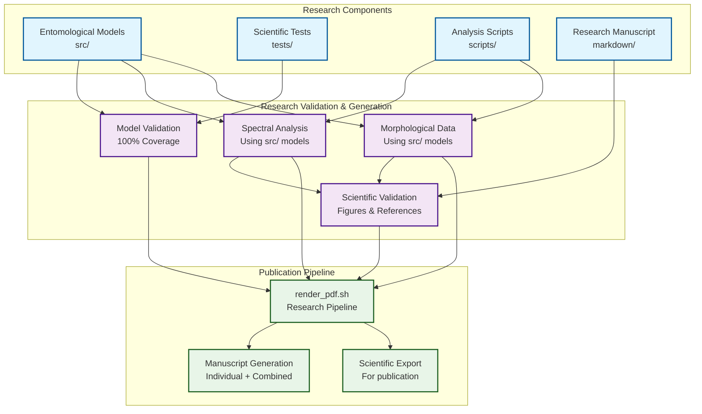
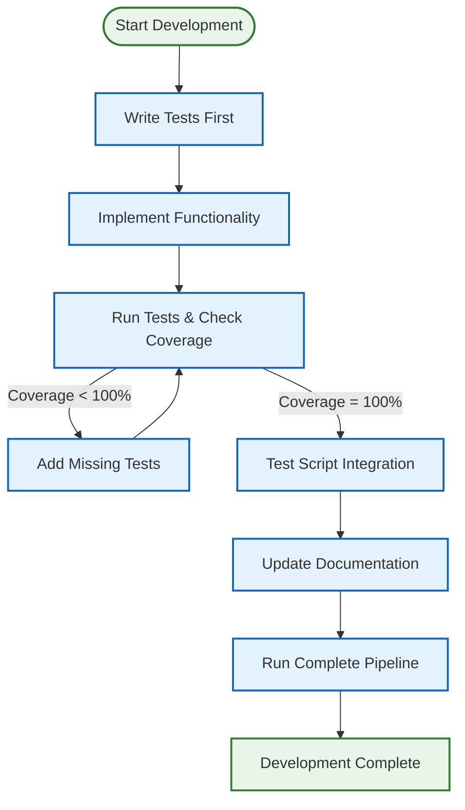
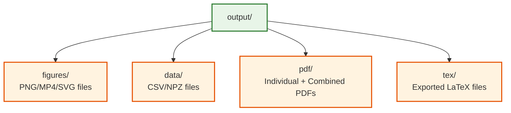

# cohereants Entomological Research Workflow: Insect Sensory System Analysis

This document explains the complete research workflow for investigating the vibrational theory of insect olfaction. The workflow ensures entomological models, spectral analyses, and scientific manuscripts remain in perfect scientific coherence. For related information, see **[`README.md`](README.md)** for project overview, **[`ARCHITECTURE.md`](ARCHITECTURE.md)**, and **[`HOW_TO_USE.md`](HOW_TO_USE.md)** for research guidance.

## Research Overview

The cohereants project implements a **unified test-driven research paradigm** where:

- **Entomological models** implement insect sensory system algorithms
- **Scientific tests** validate all sensory calculations with 100% coverage
- **Analysis scripts** are **thin orchestrators** that import and use validated models
- **Research manuscripts** integrate computational results with scientific theory
- **`render_pdf.sh`** orchestrates the complete research publication pipeline

## Complete Workflow Diagram



## How render_pdf.sh Works with Markdown and Code

The `render_pdf.sh` script is the central orchestrator that ensures complete coherence between all components:

### 1. Code Validation Phase
- **Runs all generation scripts** - This validates that `src/` code works correctly
- **Scripts import from src/** - Ensures no code duplication and validates imports
- **Generates figures and data** - Creates outputs that markdown will reference

### 2. Markdown Validation Phase
- **Validates all image references** - Ensures figures referenced in markdown exist
- **Checks internal links** - Validates equation labels and section anchors
- **Validates equation formatting** - Ensures proper LaTeX equation environments

### 3. Documentation Generation Phase
- **Auto-generates glossary** - Creates API table from current `src/` code
- **Updates documentation** - Keeps code-doc sync automatically

### 4. Output Generation Phase
- **Builds individual PDFs** - Creates per-section PDFs from validated markdown
- **Builds combined PDF** - Creates unified document from all sections
- **Exports LaTeX** - Provides LaTeX source for further processing

## Test Suite and Code Connections

The test suite ensures 100% coverage of all `src/` modules and validates the entire pipeline:

### What Tests Validate
- **Mathematical correctness** - All functions produce expected results
- **Import compatibility** - Scripts can successfully import from `src/` modules
- **Output generation** - Figure and data generation works correctly
- **Deterministic execution** - All outputs are reproducible with fixed seeds
- **Path management** - Outputs go to correct directories

### Test-Driven Development Flow


1. **Write tests first** - Define expected behavior before implementation
2. **Implement functionality** - Write code to pass tests
3. **Validate integration** - Ensure scripts can use the code
4. **Update documentation** - Reflect changes in markdown
5. **Run complete pipeline** - Use `render_pdf.sh` to validate coherence

## Step-by-Step Workflow

### 1. Development Phase

```bash
# Always start with tests
uv run pytest tests/ --cov=src --cov-report=term-missing

# Check coverage (must be 100%)
coverage report

# Make code changes in src/
# Update corresponding tests
# Update documentation if needed
```

### 2. Validation Phase

```bash
# Run tests again to ensure changes work
uv run pytest

# Generate figures and data
uv run python scripts/example_figure.py
uv run python scripts/generate_research_figures.py

# Validate markdown integrity
uv run python repo_utilities/validate_markdown.py
```

### 3. Integration Phase

```bash
# Run the complete pipeline
./repo_utilities/render_pdf.sh
```

This script:
- Runs all generation scripts (validates src/ code works)
- Validates markdown references and images
- Generates auto-updated glossary from src/ API
- Builds individual and combined PDFs
- Exports LaTeX for further processing

## Key Components

### Source Code (`src/`)
- **`example.py`**: Basic mathematical functions (add, multiply, average, etc.)
- **`glossary_gen.py`**: API documentation generation utilities
- Additional modules can be added for specific project needs

**Critical Principle**: ALL business logic and algorithms must live in `src/` modules.

### Tests (`tests/`)
- **100% coverage required** for all src/ modules
- **Real numerical examples** (no mocks)
- **Deterministic RNG seeds** for reproducibility
- **Fast and hermetic** execution

### Generation Scripts (`scripts/`)
- **Import from src/** modules (no code duplication)
- **Use src/ methods for all computation** (never implement algorithms)
- **Generate figures and data** deterministically
- **Print output paths** to stdout for manifest collection
- **Use headless plotting** (MPLBACKEND=Agg)

### Documentation (`markdown/`)
- **References source code** using inline code formatting
- **Displays generated figures** from `output/figures/`
- **Passes validation** for images, references, and equations
- **Auto-updated glossary** from source API

### Output Structure (`output/`)
```
output/
├── figures/          # PNG/MP4/SVG files
├── data/             # CSV/NPZ files and manifests
├── pdf/              # Individual and combined PDFs
└── tex/              # Exported LaTeX files
```

## Validation Rules

### Markdown Validation
- All images must exist and be properly referenced
- Internal links must have valid anchors
- Equations must have unique labels
- No bare URLs (use informative link text)

### Code Validation
- All public APIs must have type hints
- No circular imports
- Consistent formatting and naming
- Error handling for edge cases

### Test Validation
- 100% statement and branch coverage
- All tests must pass
- No network or file-system writes outside output/
- Deterministic execution

## Development Commands

```bash
# Install dependencies
uv sync

# Run tests with coverage
uv run pytest tests/ --cov=src --cov-report=term-missing

# Generate figures
uv run python scripts/example_figure.py
uv run python scripts/generate_research_figures.py

# Validate markdown
uv run python repo_utilities/validate_markdown.py

# Build complete PDF pipeline
./repo_utilities/render_pdf.sh

# Clean all generated outputs (regeneratable)
./repo_utilities/clean_output.sh

# Check specific coverage
coverage report -m
```

## Output Management

### Clean Output Script

The `clean_output.sh` script safely removes all generated outputs since everything is regenerated from markdown sources:

```bash
# Clean all generated outputs
./repo_utilities/clean_output.sh
```

This script:
- Removes `output/` directory (all disposable)
- Preserves source code, tests, markdown, and scripts
- Provides clear instructions for regeneration

**Note**: All outputs are regeneratable from source, so cleaning is safe and often useful for troubleshooting or ensuring fresh builds.

### Output Directory Structure



All directories under `output/` are disposable and can be safely cleaned.

## Benefits of This Paradigm

1. **Coherence**: Source code, tests, and documentation stay synchronized
2. **Validation**: Automatic checking of all references and outputs
3. **Reproducibility**: Deterministic generation of all artifacts
4. **Maintainability**: Clear separation of concerns with unified workflow
5. **Quality**: 100% test coverage enforced automatically
6. **Documentation**: Auto-generated API references and validation
7. **Thin Orchestrator Pattern**: Scripts use tested src/ methods, not duplicate logic

## Troubleshooting

### Common Issues

1. **Tests failing**: Check coverage and fix missing test cases
2. **Markdown validation errors**: Fix broken links, missing images, or duplicate labels
3. **Figure generation failures**: Ensure src/ modules work correctly
4. **PDF build errors**: Check pandoc and LaTeX installation

### Validation Commands

```bash
# Check what's failing
uv run python repo_utilities/validate_markdown.py

# Regenerate specific figures
uv run python scripts/example_figure.py

# Check test coverage gaps
coverage report -m
```

## Key Connections to Remember

1. **src/ modules → tests/ validation → scripts/ generation → markdown/ documentation**
2. **render_pdf.sh ensures all connections are valid before building outputs**
3. **Changes in any component must be reflected in all connected components**
4. **The test suite validates the entire pipeline, not just individual modules**
5. **Documentation is auto-generated where possible to maintain code-doc sync**
6. **Scripts are THIN ORCHESTRATORS that import and use src/ methods**
7. **Business logic lives ONLY in src/ - scripts handle orchestration and I/O**

## Thin Orchestrator Pattern

The workflow enforces a **thin orchestrator pattern** where:

- **`src/`** contains ALL business logic, algorithms, and mathematical implementations
- **`scripts/`** are lightweight wrappers that import and use `src/` methods
- **`tests/`** ensures 100% coverage of `src/` functionality
- **`render_pdf.sh`** orchestrates the entire pipeline

This ensures:
- **Maintainability**: Single source of truth for business logic
- **Testability**: Fully tested core functionality
- **Reusability**: Scripts can use any `src/` method
- **Clarity**: Clear separation of concerns
- **Quality**: Automated validation of the entire system

This workflow ensures that the generic project template maintains the highest standards of code quality, documentation coherence, and maintainability while providing a clear, scalable structure for development and collaboration.

For more details on architecture and implementation, see **[`ARCHITECTURE.md`](ARCHITECTURE.md)** and **[`THIN_ORCHESTRATOR_SUMMARY.md`](THIN_ORCHESTRATOR_SUMMARY.md)**.


## Test organization (project policy)

Tests are grouped by theme to improve discoverability and maintainability. Place tests under `tests/` and follow these conventions:

- **Core & physics**: `tests/test_core.py`, `tests/test_core_physics.py`
- **Configuration**: `tests/test_config.py`
- **Spectroscopy**: `tests/test_spectroscopy_*.py`
- **Visualization**: `tests/test_visualization.py`, `tests/test_visualization_additional.py`, `tests/test_visualization_reload.py`
- **Integration / frameworks**: `tests/test_integrated_analysis.py`, `tests/test_meta_material_framework.py`, `tests/test_fermi_estimation.py`, `tests/test_insect_analysis*.py`
- **Behavioral**: `tests/test_behavioral_analysis.py`
- **Utilities & docs**: `tests/test_glossary_gen*.py`, `tests/test_repo_utilities.py`, `tests/test_utils.py`

Ad-hoc or temporary test collections should be avoided. If you create short-term helper test files while developing, migrate their tests into the appropriate thematic file before merging and remove the temporary files. This repository follows that policy (several ad-hoc tests were consolidated into thematic files during the current refactor).

When adding tests, include a one-line comment at the top of the test function indicating why the test exists (what branch/edge-case it covers) so future reviewers can keep tests aligned to the 100% coverage requirement.
