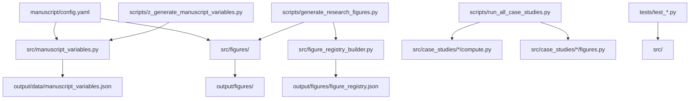

# Architecture: Domain Module Map

**cohereants** models insect infra-red perception, cuticular-hydrocarbon spectroscopy, sensilla electromagnetics, and biomimetic IR sensor feasibility. Business logic lives in `src/`; `scripts/` are thin orchestrators; the template `infrastructure/` layer handles rendering, validation, and pipeline stages.

## Domain Module Map

Derived from the project README — the authoritative module-to-domain mapping:

| Domain | Module(s) |
| --- | --- |
| Atmospheric IR transmission and physics constants | `src/core.py` |
| Cuticular-hydrocarbon (CHC) IR spectroscopy | `src/spectroscopy.py` |
| Sensilla morphology and wavelength matching | `src/sensilla.py` |
| Behavioral response statistics | `src/behavioral.py` |
| Fermi estimation of molecular/neural information | `src/fermi_estimation.py` |
| Metamaterial / plasmonic framework | `src/meta_material_framework.py` |
| Integrated cross-domain analysis | `src/integrated_analysis.py`, `src/insect_analysis.py` |
| Layered ant model (body / brain / mind) | `src/ant_stack/` |
| Case studies (detection limits, neural encoding, spectral unmixing, …) | `src/case_studies/` (package per appendix: `compute.py`, `types.py`, `figures.py`) |
| Visualization (colourblind-safe, 300 dpi) | `src/viz/` (`styling`, `panels`, `appendix_grid`, `advanced`); shim `src/visualization.py` |
| Manuscript tokens and figure registry | `src/manuscript_variables.py`, `src/figures/`, `src/figure_registry_builder.py`, `src/figure_artifacts.py` |
| Protocol fixtures (pre-registered bounds) | `src/manuscript_fixtures.py` |

## Layer Reference

| Layer | Role | Invariants |
| --- | --- | --- |
| **`src/`** | Domain algorithms, figure builders, variable generation | Tested; ≥90% coverage; no new mocks |
| **`scripts/`** | I/O, matplotlib saves, subprocess orchestration | No domain algorithms; print output paths |
| **`manuscript/`** | Narrative, config, bibliography | Registry-backed figures and `{{TOKEN}}` numbers |
| **`output/`** | Generated figures, data, PDF intermediates | Disposable; regenerate from pipeline |
| **`infrastructure/`** (template) | Render, validate, discover, test runner | Generic; no cohereants-specific math |

## Dependency Direction

```
scripts/ ──→ src/              (calls domain functions)
scripts/ ──→ infrastructure/   (logging, manuscript injection)
tests/   ──→ src/              (real data and computation)
src/     ──→ [numpy, scipy, sklearn, matplotlib, yaml]
```

No cross-project imports. Domain modules may import sibling `src/` packages; they must not import other projects under `projects/`.



## Script Entry Points

| Script | Purpose |
| --- | --- |
| `scripts/generate_research_figures.py` | Core manuscript figures via `src/figures.generate_core_manuscript_figures()` |
| `scripts/run_all_case_studies.py` | Appendix / integrated analysis figure batch |
| `scripts/z_generate_manuscript_variables.py` | Hydrates `{{TOKEN}}` → `output/manuscript/` |
| `scripts/generate_*.py` | Individual case-study thin orchestrators |

## Forbidden Patterns

| Pattern | Why forbidden | Correct alternative |
| --- | --- | --- |
| Spectroscopy or antenna math in `scripts/` | Untested, non-reusable | Move to `src/`, add tests |
| Hard-coded SNR or timing numbers in manuscript | Drifts from analysis | Use `{{SNR_OPERATING_DB}}` etc. |
| Asserting vibrational IR olfaction as proven | Hypothesis is contested | Frame as falsifiable prediction; cite `data/claim_ledger.yaml` |
| New `unittest.mock` in tests | Template contract | Real arrays, `tmp_path`, subprocess |
| Committing under public `template/projects/cohereants` | Confidentiality invariant | Commit only in private `passive/cohereants` |

## Adding a New Analysis Module

1. Implement in `src/` (or `src/case_studies/`) with type hints and docstrings.
2. Add tests under `tests/` using deterministic fixtures; keep coverage ≥90%.
3. Add a thin `scripts/generate_*.py` that imports from `src/` and prints paths.
4. Register figures in `src/figure_registry_builder.py` and document labels in `manuscript/AGENTS.md`.
5. Extend `src/manuscript_variables.py::generate_variables()` if prose needs new tokens.
6. Re-run analysis → variable hydration → render (see [`rendering_pipeline.md`](rendering_pipeline.md)).

## See Also

- [`../README.md`](../README.md) — Domain table source
- [`testing_philosophy.md`](testing_philosophy.md) — Coverage and mock policy
- [`output_conventions.md`](output_conventions.md) — Artifact paths
