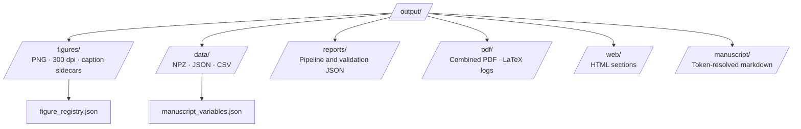

# Output Directory Conventions

Project-relative `output/` holds all generated artifacts from analysis and rendering. Nothing under `output/` is hand-edited; regenerate via scripts.

## Directory Purpose

`output/` is **disposable but regeneratable**. Source of truth:

- Domain code in `src/`
- Parameters in `docs/manuscript/config.yaml` and `src/manuscript_fixtures.py`
- Thin orchestrators in `scripts/`

## Directory Structure



### Key artifacts

| Path | Role | Producer |
| --- | --- | --- |
| `output/figures/*.png` | Manuscript and appendix figures | `scripts/generate_research_figures.py`, case-study scripts |
| `output/figures/*.caption.txt` | Caption text for registry | `src/figures.py` |
| `output/figures/figure_registry.json` | Label → path → method metadata for validation | `src/figure_registry_builder.py` |
| `output/data/*.npz` | Numerical arrays (timing, detection limits, sensilla) | Case-study and core analysis |
| `output/data/detection_limits_spec.json` | SNR operating point spec | Detection-limits pipeline |
| `output/data/manuscript_variables.json` | Full `{{TOKEN}}` map | `scripts/z_generate_manuscript_variables.py` |
| `output/manuscript/*.md` | Substituted copies for PDF render | Infrastructure manuscript injection |
| `output/pdf/cohereants_combined.pdf` | Working combined PDF | Template stage 6 |
| `output/reports/test_results.json` | Test gate record | `scripts/01_run_tests.py` |

## Regeneration Sequence

1. **Optional clean:** `rm -rf output/` (safe — everything rebuilds).

2. **Core figures and data:**
   ```bash
   MPLBACKEND=Agg .venv/bin/python scripts/generate_research_figures.py
   MPLBACKEND=Agg .venv/bin/python scripts/run_all_case_studies.py
   ```

3. **Manuscript variables** (strict unless `--allow-draft`):
   ```bash
   MPLBACKEND=Agg .venv/bin/python scripts/z_generate_manuscript_variables.py
   ```
   Requires `output/data/response_time_comparison.npz` and `output/data/detection_limits_comprehensive.npz` by default.

4. **Full pipeline from template root** (when symlinked):
   ```bash
   uv run python scripts/execute_pipeline.py --project cohereants --core-only
   ```

5. **Final deliverables** copied to template `output/cohereants/` by stage 9 when run through the pipeline.

## figure_registry.json

Written beside figures at `output/figures/figure_registry.json`. Each entry includes:

- `label` — LaTeX figure key (e.g. `fig:response_time_comparison`)
- `path` / `filename` — PNG on disk
- `caption` — Includes generation method sentence per `src/figure_registry_contract.py`
- `metadata.claim_boundary` — States what the figure does **not** prove

Infrastructure figure validation reads this registry during output validation.

## manuscript_variables.json

Schema:

```json
{
  "variables": { "SNR_OPERATING_DB": "10", "...": "..." },
  "generated_at": "2026-05-26T12:00:00Z"
}
```

Used at render time and by evidence-registry checks. Authoritative token list: `src/manuscript_variables.py::generate_variables()`.

## Version-Control Policy

- **`output/` is gitignored** in normal workflow — do not commit generated PNGs or PDFs to the private repo unless explicitly releasing an evidence bundle.
- Edit generators in `src/` or templates in `docs/manuscript/`, not files in `output/`.

## Adding a New Output File

1. Write from `src/` with a fixed filename under `output/figures/` or `output/data/`.
2. Register label in `src/figure_registry_builder.py` if it is a manuscript figure.
3. Add tokens to `generate_variables()` if prose references numeric results.
4. Document the label in [`../manuscript/AGENTS.md`](../manuscript/AGENTS.md).

## See Also

- [`rendering_pipeline.md`](rendering_pipeline.md) — Stage order
- [`syntax_guide.md`](syntax_guide.md) — Token and figure syntax
- [`../domain_profile.yaml`](../domain_profile.yaml) — `artifact_expectations` list
